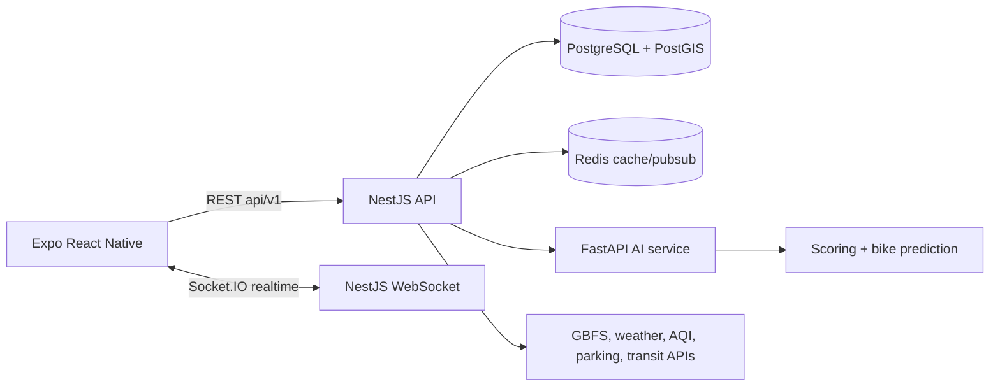

# Modality Flow - architecture production

## 1. Vision produit

Modality Flow est une application mobile de mobilite urbaine intelligente. Elle recommande le meilleur mode de transport selon le temps, le CO2, le confort, la disponibilite velo, la meteo, la pollution et le trafic.

Positionnement: Citymapper + assistant IA + couche ecologique + cockpit operationnel pour villes, campus et operateurs de mobilite.

## 2. Architecture globale



Backend:
- `stations`: stations velos, disponibilite, geolocalisation PostGIS.
- `parkings`: parkings connectes et disponibilite.
- `journey`: options multi-modales, scoring IA, timeline, persistance trip.
- `predict`: prediction velos a 30 min.
- `dashboard`: KPI ville.
- `realtime`: Socket.IO pour pousser les stations actualisees.

## 3. Stack technique

- Mobile: React Native Expo, TypeScript, NativeWind-ready, Reanimated, Socket.IO, Mapbox.
- API: NestJS, REST, WebSocket, PostgreSQL via `pg`.
- Data: PostgreSQL 16 + PostGIS, Redis 7.
- IA: Python FastAPI, scoring pondere, simulation RandomForest-compatible pour prediction.
- Infra: Docker Compose en local, scalable vers Kubernetes ou ECS.

## 4. Structure dossiers

```text
apps/
  mobile/
    App.tsx
    src/components/
    src/screens/
    src/services/
    src/types/
  api/
    src/common/
    src/modules/ai/
    src/modules/dashboard/
    src/modules/journey/
    src/modules/parkings/
    src/modules/predictions/
    src/modules/realtime/
    src/modules/stations/
  ai-service/
    app/main.py
database/
  schema.sql
docs/
  ARCHITECTURE.md
```

## 5. API endpoints

- `GET /api/v1/stations`
- `GET /api/v1/stations/:id`
- `GET /api/v1/stations/nearest?lat=...&lon=...`
- `GET /api/v1/stations/best?lat=...&lon=...`
- `GET /api/v1/parkings`
- `POST /api/v1/journey`
- `POST /api/v1/predict`
- `GET /api/v1/predict/:stationId`
- `GET /api/v1/dashboard/kpi`
- WebSocket namespace: `/realtime`, events `stations:refresh`, `stations:update`

## 6. Scaling

- Remplacer le polling par ingestion provider via workers planifies.
- Utiliser Redis pour cache de stations, rate limiting, pub/sub WebSocket multi-instance.
- Ajouter read replicas PostgreSQL pour requetes geospatiales fortes.
- Separer `journey` en service de routing si integration GTFS/Mapbox Directions grossit.
- Ajouter feature store IA pour historiques station/meteo/AQI.
- Deployer API, IA et workers separement avec autoscaling CPU/RPS.

## 7. Monetisation

- B2C freemium: recommandations avancees, alertes commute, routes bas carbone.
- B2B SaaS: dashboard ville, heatmaps, prediction demande, SLA API.
- Partenariats: operateurs velos, parkings, transit, entreprises campus.
- API payante: scoring multimodal et disponibilite predite pour tiers.

## 8. Roadmap startup

1. MVP production local: Montpellier, velos + parkings + scoring + Expo.
2. Beta pilote: donnees GBFS reelles, meteo/AQI, notifications push.
3. V1: auth, favoris, historique, Mapbox Directions, observabilite.
4. SaaS ville: console web, alerting operations, exports, multi-tenant.
5. IA avancee: XGBoost/LightGBM par station, prediction demande, retraining quotidien.
